# 指导：从北京（BJS）迁移AWS服务到宁夏（ZHY）

本指南将逐步介绍如何将您在 AWS 北京区域的服务迁移到宁夏区域，涵括范围如下：

 - EC2 & AMI
 - EBS
 - S3
 - RDS
 - Redis
 - DynamoDB

## 1. 将 EC2 & AMI 服务从 BJS 迁移至 ZHY

本部分将逐步介绍如何将 EC2 实例导出为 AMI，并从北京迁移到宁夏区。

#### 步骤一 创建AMI

 - 在 EC2 控制台中，在左侧选择栏中点击 Instances，选中您希望迁移的实例，右键选择 Image -> Create Image。

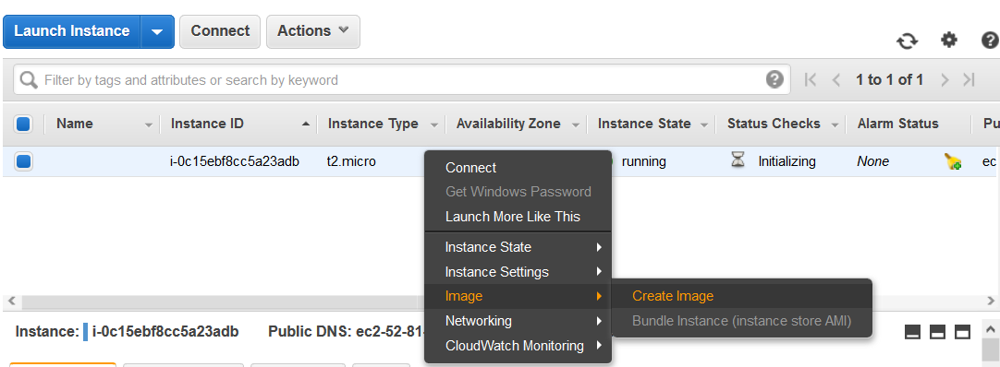

 - 也可选择使用 CLI 命令行进行操作。

	aws ec2 create-image --instance-id [your instance id] --name [your AMI name]

 - 在控制台左侧选择 Images-> AMIs 检查已创建的 AMI。

#### 步骤二 将 AMI 部署在您希望转移的地区

 - 在 EC2 控制台中，右击刚创建的 AMI，选择 Copy AMI。

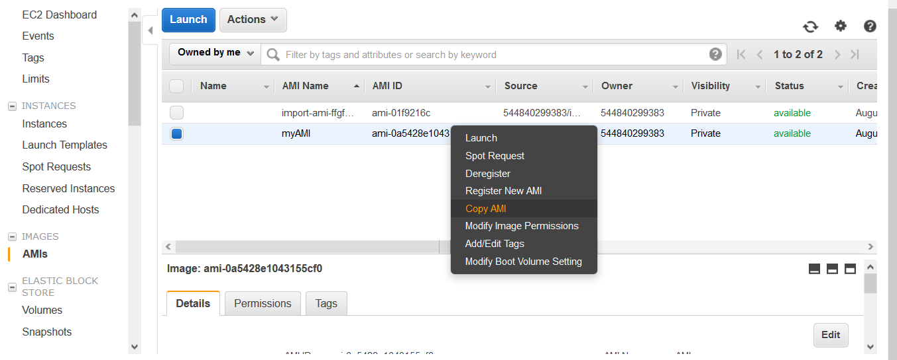

 - 在 Destination region 部分选择您希望迁移的目标可用区。

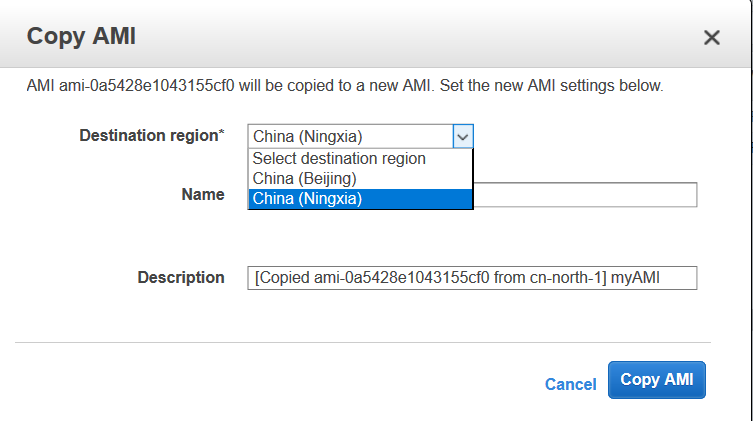

 - 您也可选择使用 AWS CLI 命令行创建 AMI。

	aws --region cn-northwest-1 ec2 copy-image --source-region cn-north-1 --source-image-id [your image id] --name [your AMI name]
	
 - 在控制台左侧选择栏，选择 Images-> AMIs 查看刚刚创建的 AMI,右键点击 Launch 部署您的 EC2 服务。

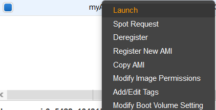

## 2. 将EBS服务从BJS迁移至ZHY

本部分将逐步介绍如何将 EBS 卷从北京迁移到宁夏区。

#### 步骤一 创建快照

 - 为对应 EBS 卷创建实例。右击卷名称，选择 Create Snapshot。

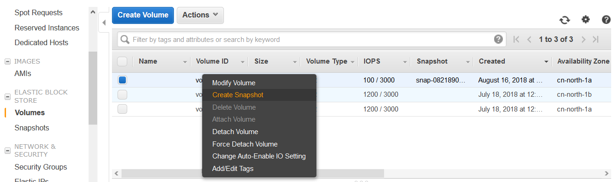

#### 步骤二 迁移到其他可用区

 - 在控制台左侧选择栏点击 Snapshots, 选中您刚创建的实例，点击 Action -> Copy 复制快照到其他可用区。

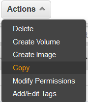

 - 在目标区域中选择宁夏，点击 Copy。

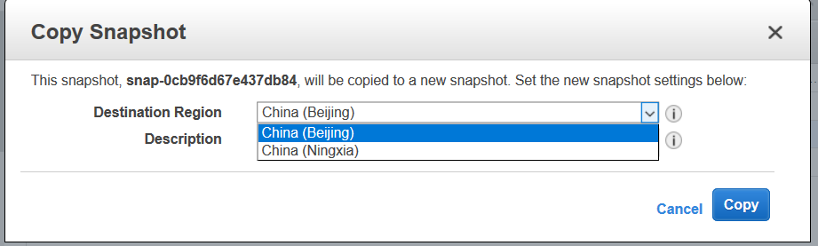

 - 创建完成后，请将控制台切换到宁夏区，可以查看上一步骤中复制的快照，右击快照选择 Create Volume 部署 EBS。

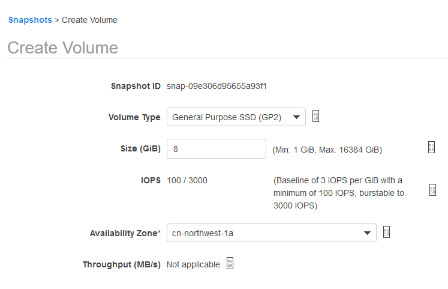

## 3. 将 RDS 服务从 BJD 迁移至ZHY 

本实例使用 RDS 的 MySQL 作为案例，您也可以迁移 RDS 中其他数据库服务。

（1）方案一 创建快照部署到其他区域

该方法使用 RDS 数据库在宁夏区创建快照，并重新部署快照，实例与快照之间转换时间较长，若您的数据库较小，可选用该方案。

 - 在RDS控制台选中您希望转移的实例，依次选择 Action -> Take a DB snapshot。

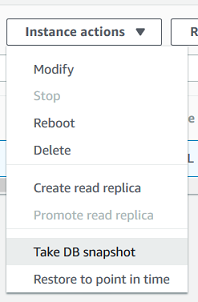

 - 填写快照名称。

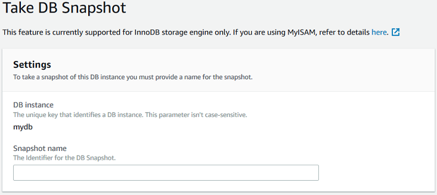

 - 在左侧导航栏中选择 Snapshot，右击刚创建的快照，选择 copy snapshot 复制 RDS 服务快照。

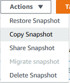

 - 选择宁夏区作为您复制快照的目标区域。

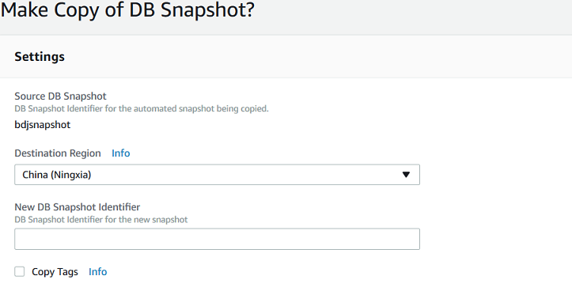

 - 您可以在宁夏区的 snapshot 中查看上一步复制的快照，并在宁夏区重新部署该服务。

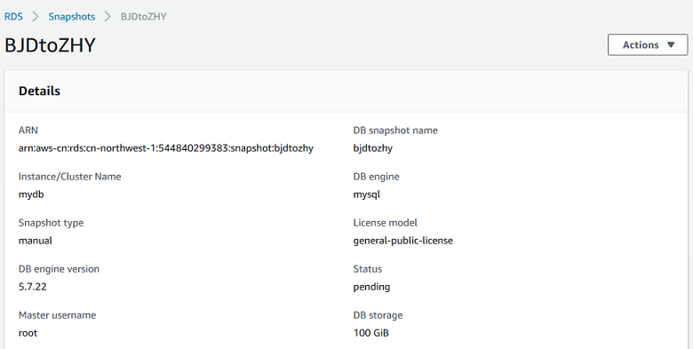

（2）方案二 基于 BJS Master Node 迁移数据

使用 RDS 平台中 Read Replica 功能将数据拷贝到宁夏区，步骤如下：

 - 在北京区点击您希望迁移的数据库，进入页面后，选择 Instance actions -> Create read replica。

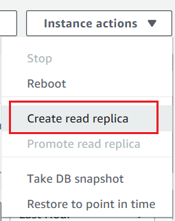

 - 选择将复制实例放在宁夏区，Multi-AZ deployment 选择 Yes。 

	

 - 按需求配置复制实例其他参数。

 - 选择 Create read replica，等待数据库部署完毕。

 - 选择 Instance actions -> Promote Read Replica。将其升为主库。

 注意：
 
 宁夏区 MySQL 最低版本为 5.6.29，若您北京区的 MySQL 版本低于宁夏区，需要选择 Modify 升级数据库。

 若您的数据库有其他 Read Replica, 需先升级复制项。

## 4. 将S3服务从BJD迁移至ZHY

本部分将逐步介绍如何将 S3 服务迁移到新的可用区，您有以下两种迁移方案：

1. 在宁夏区（目标区）创建一个新的 S3 桶，将数据拷贝到该桶中。
2. 删除原数据桶并在宁夏区（目标区）重新创建同名 S3 桶，该方案需要一个临时桶作为转移媒介。
	
    注意:该方法需要在删除旧 S3 桶后等待24小时至名称再次有效。

##### （1）创建新的S3桶

 - 在 S3 控制台中，点击 Create Bucket，选择宁夏作为桶的可用区，在 Copy settings from an existing bucket 选项中，选择您欲做迁移的 S3 桶，可同步两个桶的配置。

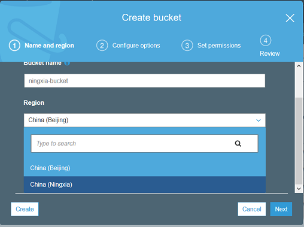

 - 在 CLI 端运行以下命令行，开始复制桶内文件。

	aws s3 sync s3://SOURCE_BUCKET_NAME s3://NEW_BUCKET_NAME

##### （2）重新创建S3桶

 - 创建临时桶，步骤参见（1）。
 - 在 CLI 端逐步运行以下命令行，将旧 S3 桶中的内容存入临时桶。

	aws s3 sync s3://foobucket s3://tmpbucket
 
 - 在控制台中旧 S3 桶删除，等待24小时后该命名重新生效。
 - 重新在宁夏区注册同名 S3 桶。
 - 在 CLI 端逐步运行以下命令行，将临时桶中的文件存入目标桶。

	aws s3 sync s3://tmpbucket s3://foobucket

## 5. 将 ElastiCache 服务从BJD迁移至ZHY

本例中将逐步介绍如何将 ElastiCache 服务迁移到另一可用区，本实例使用 Redis 作为案例。

#### 步骤一 备份 Redis 服务到S3

  - 创建备份前请停止写入操作。
 
  - 在控制台选中希望迁移的 Redis 服务，点击上方的 Backup 按钮创建备份。
	
	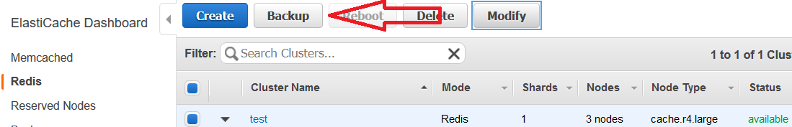

 - 在控制台左侧选择栏中点击 Backups 选项，查看您刚创建的备份。

	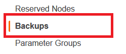
	
 - 创建一个 S3 桶用来存储 ElastiCache 备份。
   注意：桶的**可用区**需要和 ElastiCache 相同。

 - 登录 AWS [S3 控制台](https://console.aws.amazon.com/s3)，并创建新的 S3 桶，请参考本指南 4 创建桶。
 - 依次选择 Permissions -> Access Control List。
 - 在 Access for other AWS accounts 下, 选择 + Add account。
 - 在窗口内添加地区的 canonical id。

    BJD (Beijing) 和 ZHY (Ningxia) :      
	b14d6a125bdf69854ed8ef2e71d8a20b7c490f252229b806e514966e490b8d83

 - 下述选项勾选Yes:
   *List objects
   Write objects
   Read bucket permissions*

   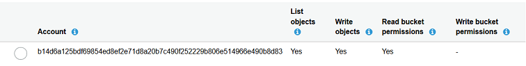

 - 选择 Save，授权 ElastiCache 读写 S3 桶内文件.

#### 步骤二 将备份部署到宁夏区

 - 参考 4 将位于北京区的 S3 桶中文件迁移至宁夏区，或下载备份文件，上传到您位于宁夏的 S3 桶中。

 - 参考步骤一，在宁夏区 S3 桶添加 ElastiCache 读文件权限。

 - 在宁夏区建立新的 Redis 服务。

 - 在 Import data to cluster 项中填入位于宁夏 S3 桶中的备份文件路径。

 	

## 6. 将 DynamoDB 服务从 BJS 迁移至 ZHY

将您的 DynamoDB 服务迁移到宁夏区。

（1）使用自定义 API

您可以使用 API 将 BJS 的数据转移到 ZHY，您可根据需要编写程序配置参数，示例程序如下：

	from __future__ import print_function
	import boto3
	import argparse

	def replicate(table_name, existing_region, new_region, new_table_name):
    """
    Replicate table in new region.
    Creates a new table with existing KeySchema and AttributeDefinitions
    default read and write capacity units are set to 5. Change it as required.
    Parameters
    ----------
    table_name: string
        Name of the existing table to be replicated.
    existing_region: string
        Region in which the table is present.
    new_region: string
        Region in which the table needs to be replicated.
    new_table_name: string
        Name for the new table to be created, if not given
        existing table name is used.
    """

    	existing_table = boto3.resource(
        	'dynamodb', region_name=existing_region).Table(table_name)
   		items = existing_table.scan()['Items']

    	dynamodb = boto3.resource('dynamodb', region_name=new_region)

    	print("Creating table '{0}' in region '{1}'".format(
        new_table_name, new_region))

    	table = dynamodb.create_table(
        	TableName=new_table_name,
       	 	KeySchema=existing_table.key_schema,
        	AttributeDefinitions=existing_table.attribute_definitions,
        	ProvisionedThroughput={
            	'ReadCapacityUnits': 5,
            	'WriteCapacityUnits': 5
        	})
    	print("Table status:", table.table_status)

    	table.wait_until_exists()
    	table.reload()

    	print("Table status:", table.table_status)
    	print("Updating table with data...")
    	if table.table_status == 'ACTIVE':
        	for item in items:
           	 	response = table.put_item(Item=item)
            	print("PutItem status:",
                  	response['ResponseMetadata']['HTTPStatusCode'])

    	print("Total items created:", table.scan()['Count'])

	if __name__ == "__main__":
    	parser = argparse.ArgumentParser()
    	parser.add_argument(
        	'-t',
        	'--table_name',
       	 	type=str,
        	required=True,
        	help="Name of the table to be replicated in new region")
    	parser.add_argument(
        	'-r',
        	'--region',
       		type=str,
        	required=True,
        	help="Region in which the table is present")
    	parser.add_argument(
        	'-nr',
        	'--new_region',
        	type=str,
        	required=True,
        	help="Region in which the table needs to be replicated")
    	parser.add_argument(
        	'-nt',
        	'--new_table_name',
       	 	type=str,
        	help="Name for the new table [Optional], Old table name will be used")
    	args = parser.parse_args()
    	if args.new_table_name is None:
        	args.new_table_name = args.table_name

    	replicate(args.table_name, args.region, args.new_region,
              args.new_table_name)

您可以在终端执行如下代码：

	python transferDynamoDB.py -t [source table] -r [source region] -nr [destination region]

（2）使用 EMR Hive 中转迁移数据到宁夏

使用 Amazon EMR 服务创建集群，使用 EMR Hive 将 BJS 数据迁移到 ZHY。

 - 在 [EMR 控制台](https://console.amazonaws.cn/elasticmapreduce/home?region=cn-north-1)创建集群。

 - 使用 SSH 连接主机。

	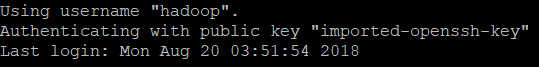

 - 登入 Hive

	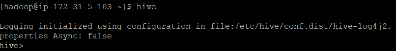
 
 - 在 Hive 创建2个 External table，location 分别指向 BJS 和 ZHY。

	CREATE EXTERNAL TABLE hive_table 
    	(hive_column1_name hive_column1_datatype, hive_column2_name hive_column2_datatype...)

	STORED BY 'org.apache.hadoop.hive.dynamodb.DynamoDBStorageHandler' 

	TBLPROPERTIES (
    	"dynamodb.table.name" = "dynamodb_table", 
    	"dynamodb.column.mapping" = "hive_column1_name:dynamodb_attribute1_name,hive_column2_name:dynamodb_attribute2_name..."
	);

 - 使用 query 将 BJS 数据复制到 ZHY。

	注意：可使用 insert into 进行复制，以免覆盖原数据。

数据库迁移完毕后，请及时更改服务器配置。