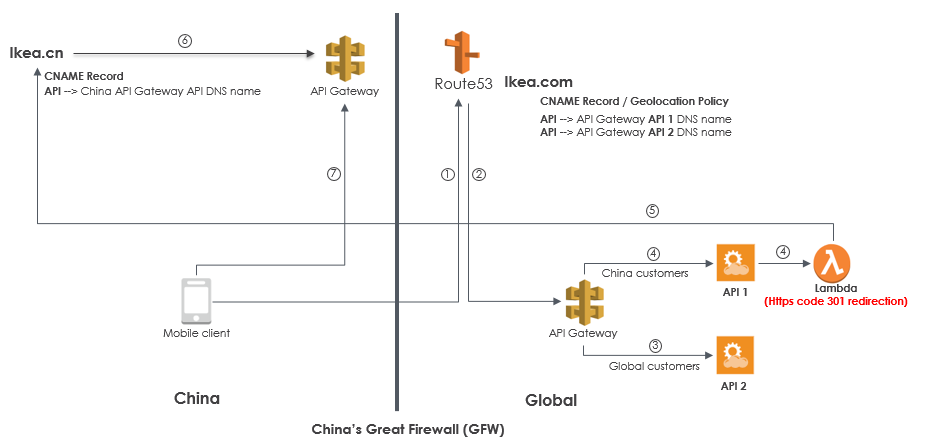
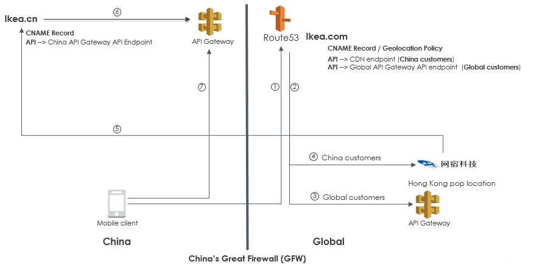
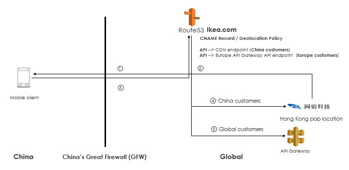

# 在中国合法部署海外IP

本文将介绍在不将主域名做 ICP 备案的情况下，在 AWS China Region 部署您的服务。若您希望：

1. 在国内备案对应 .cn 域名，访问主域名 www.example.com 时自动跳转至 www.example.cn。
2. 在国内备案对应 .cn 域名，访问主域名 www.example.com 时使用海外 CDN 节点加速。
3. 不在国内备案 .cn 域名，使用 www.example.com 访问，且服务全部部署在海外。

可参考我们为您提供的三种部署方案：

1. 利用部署在海外的 API Gateway 和 Lambda，访问 www.example.com 时返回 301 www.example.cn。
2. 使用 CNC (网宿)的香港、台湾等节点做 CDN 回源 China Region, 经实测延迟大约为700ms, 网宿的 SLA 为2秒，丢包情况很少发生。
3. 使用 CNC 的香港，台湾节点加速；使用电信的 CN2IP 加速访问。

## 一、 国内备案.cn等域名

该方案使用 Amazon API Gateway 及 Lambda 服务。您可在国内地区部署服务并注册 www.example.cn 域名并备案，当用户访问 www.example.com 时，主域名配置的海外 API Gateway 会为客户自动转调到 www.example.cn。

架构搭建：

1. 用户在中国注册代理域名，在 ICP 备案。
2. 在 China Region 搭建代理服务器及 API Gateway。
3. 在 Amazon Global Region 部署 Route53 + API Gateway + Lambda，可转跳服务到 China Region。

数据流：

1. 用户访问主域名。
2. Route53 使用 geolocation route policy 功能，根据用户所处地区向不同 API Gateway 发送请求。
    - 海外用户请求将被导航到 API 2。
    - 国内用户请求将被导航到 API 1，调用相关 Lambda 方法。
3. Lambda 将用户重新导航到您在国内注册的域名中。
4. 您在国内的域名将被解析至中国的 API Gateway API DNS 名称。
5. 用户使用手机客户端直接访问位于中国的 API Gateway。

## 二、 CNC（网宿） 回源 China Region

该方案使用 CDN 加速，您需在国内部署网络服务，当国内用户访问主域名时，可使用位于香港的 CNC 回源位于国内的服务。

架构搭建：

1. 用户在中国注册代理域名，在 ICP 备案。
2. 在 China Region 搭建代理服务器及 API Gateway。
3. 注册位于海外（香港、台湾等）的CDN节点。
4. 在 Global Region 部署 Route 53 + API Gateway，可转跳服务到 CDN 节点。

数据流：

1. 客户访问主域名。
2. Route 53 使用 geolocation route policy 功能，根据用户所处地区为用户分配IP。
    - 海外用户请求将被导航到海外 API Gateway。
    - 国内用户请求将被导航至位于香港或台湾的 CDN 节点
3. CDN 节点回源位于国内的代理服务。
4. 您在国内的域名将被解析至中国的 API Gateway API DNS 名称。
5. 用户使用手机客户端直接访问位于中国的 API Gateway。

## 三、 海外CNC节点加速

该方案使用海外 CNC 节点加速，当用户访问主域名时，可使用位于海外的 CDN 节点加速访问，您也可选择 CN2 链路优化访问速度，该方案不需要在国内部署代理服务。

架构搭建：

1. 注册位于海外（香港、台湾等）的CDN节点。
2. 在 Global Region 部署 Route 53 + API Gateway，可转跳服务到 CDN 节点。

数据流：

1. 客户访问主域名。
2. Route 53 使用 geolocation route policy 功能，根据用户所处地区为用户分配 IP。
    - 海外用户请求将被导航到海外 API Gateway。
    - 国内用户请求将被导航至位于香港或台湾的 CDN 节点
3. CDN 节点回源到海外资源，并返回给用户。

