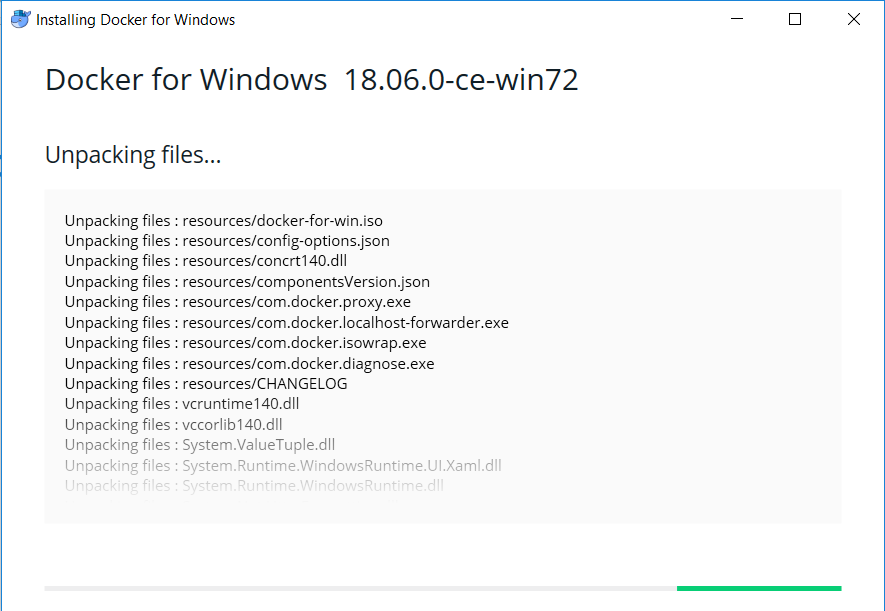
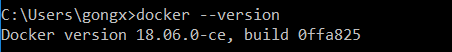
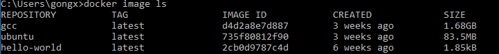
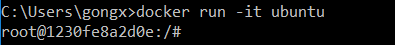
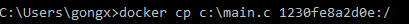
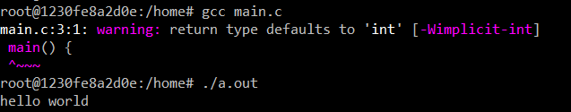

# IoT 开发环境： 可编译 C 的 Docker 镜像

该指南包含在 Windows 环境安装 Docker，使用 Dockerfile 配置环境以及相关操作介绍。 

## 步骤一 在本地安装 Docker 

在Docker官网下载 [Windows 端安装包](https://docs.docker.com/docker-for-windows/install/)

安装后，在开始菜单输入cmd打开命令窗口，输入

	docker --version

检查是否安装完毕。

在桌面点击图标，等待加载完成，右下角图标显示：

## 步骤二 配置 Docker

Docker 中的镜像文件可以通过命令行下载、导入本地镜像文件等方法进行配置。

（1） 方法一 Dockerfile 配置带 gcc 编译器的 ubuntu 系统。

	FROM ubuntu
	ENV DEBIAN_FRONTEND noninteractive
	RUN apt-get update && \
    	apt-get -y install gcc mono-mcs && \
		rm -rf /var/lib/apt/lists/*

您可使用上述文本创建 Dockerfile 文件，通过以下命令调用它创建该 docker 镜像：

	docker build -t [your image] [directory of the dockerfile]

docker build 命令将读取指定路径下(包括子目录)的 Dockerfile，并将该路径下的所有内容发送给Docker服务端，由服务端来创建镜像。

（2）方法二 加载 ubuntu 系统的镜像

调用下述代码下载ubuntu 镜像。

	docker pull ubuntu 

创建 docker 后，您可通过命令行：
 
	docker image ls 

查看本机安装的 docker 列表

到此处您的 docker 已经配置完毕，您可以新建并启动镜像，开始编译 C 程序了。

依次执行下述命令配置编译环境

	apt-get update 
    apt-get -y install gcc mono-mcs
	rm -rf /var/lib/apt/lists

使用下述命令可以将本机文件拷贝进容器

输入 gcc main.c 后生成 a.out 执行文件

您也可使用 gcc main.c -o main 命令直接生成可执行文件 

## Docker 相关操作

1、Docker导入本地镜像

若需要导入本地的镜像，可使用

	docker import 

注意镜像文件必须是tar.gz类型文件。

2、删除镜像

若需删除某些镜像。使用如下的命令：

	docker rmi -f image_id 

-f：表示强制删除镜像；image_id：镜像id

3、映射端口

若docker需要使用本机端口使用-p或-P参数来指定端口映射，使用-P(大写P)标记时，Docker会随机映射一个端口到内部容器开放的网络端口。

	$ 映射
	docker run -d --name [] -P []:latest 
	docker run -itd --name [] -p 80:80 []:latest 
	$ 查询
	docker ps 

4、创建数据卷

使用-v参数也可以指定挂载一个本地目录到容器中去作为数据卷（推荐方式）。

	docker run -itd --name [] -v [本地目录]:[容器内目录] []:latest

5、启动容器

启动一个已经暂停的容器时，可使用命令：

docker start [CONTAINER ID]

6、终止容器

停止一个正在运行中的容器。使用命令：

	docker stop [-t|--time[=10]] [CONTAINER...]

执行了 docker stop 命令之后，docker 首先会向容器发送 SIGTERM 信号，等待一段时间（默认10秒）后，再发送 SIGKILL 信号来终止容器。
