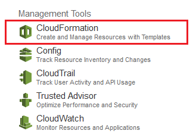
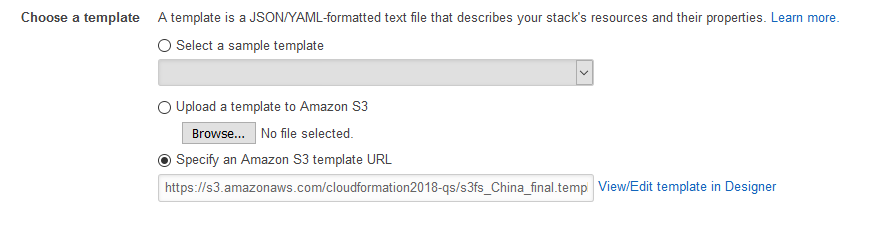
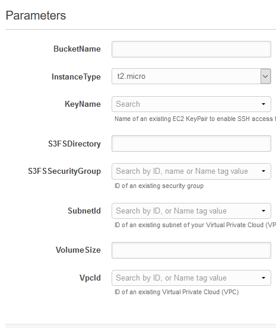
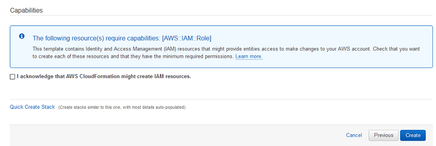
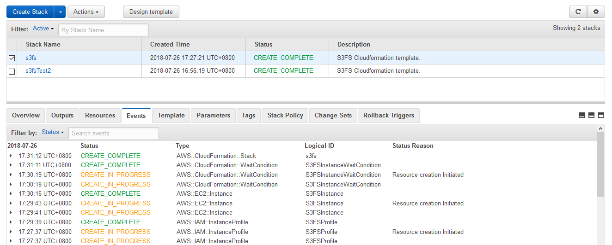
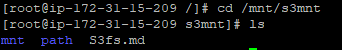

# Guide: S3FS快速部署

您可以启动Quick Start，将 S3fs 部署到 AWS 账户中。完成部署需要约 5 分钟。请查看下述实施详细信息，按照此指南后面部分提供的分步说明进行操作。

 &nbsp;&nbsp;&nbsp;&nbsp;&nbsp;&nbsp;&nbsp;

**步骤一：加载Quick Start**

- 在您的 AWS 账户中启动 AWS CloudFormation 模板。

- 请确保您的账户有一个VPC和私网，如 [Amazon VPC](http://docs.aws.amazon.com/AmazonVPC/latest/UserGuide/VPC_DHCP_Options.html)中所述。
- 检查导航栏右上角显示的所在区域，根据需要进行更改。
- 在 **Select Template** 页面上，保留模板 URL 的默认设置，然后选择 **Next** 。

- 在 **Specify Details** 页面上，填写堆栈名称及相关参数，根据需要进行更改（见下表）。完成后选择 **Next** 进入下一步。
  **部署S3FS的配置参数**

| 参数标签 | 参数名称 | 默认值 | 说明 |
| --- | --- | --- | --- |
| VPC | VpcId | _需要输入_ | 将部署S3FS实例的 VPC的ID (例如，vpc-0343606e)。 |
| 子网 | SubnetId | _需要输入_ | 要部署S3FS实例的 VPC 中现有子网的 ID (例如，subnet-a0246dcd)。 |
| 密钥名称 | KeyName | _需要输入_ | 公有/私有密钥对，使您能够在实例启动后安全地与它连接。|
| S3 存储桶名称 | BucketName | _需要输入_ | 将部署的S3FS实例所使用的S3 存储桶。 |
| 实例类型 | InstanceType | _可选_ | 选择您S3FS实例的实例类型。|
| EBS卷容量 | VolumeSize | _需要输入_ | 选择您实例EBS卷的容量。|
| 安全组 | S3FSSecurityGroup | _需要输入_ | 选择您的安全实例。|
| 目录 | S3FSDirectory | _需要输入_ | 输入需要与您S3相连的实例的目录。（例如，/mnt/s3）|

截图如下：

- 在 **Options** 页面上，您可以为堆栈中的资源 [指定标签](https://docs.aws.amazon.com/AWSCloudFormation/latest/UserGuide/aws-properties-resource-tags.html) (键/值对) 并 [设置高级选项](https://docs.aws.amazon.com/AWSCloudFormation/latest/UserGuide/cfn-console-add-tags.html)。在完成此操作后，选择 **Next** 。
- 在 **Review** 页面上，查看并确认模板设置。选择 **Capabilities** 下的复选框，以确认模板将创建 IAM 资源。

- 选择 **Create** 以部署堆栈。
- 监控堆栈的状态。当状态为 **CREATE\_COMPLETE** 时 (如图4所示)，表示 MongoDB 群集已准备就绪。

****步骤二 连接到实例****
- 当 AWS CloudFormation 模板成功创建堆栈后，您需要通过SSH连接AWS账户中已安装的S3fs实例。
- 进入 **/mnt/s3mnt** 目录，可发现实例已经与您的S3桶相连。

