# 使用 SMS & VM-import 导入 VM 指导

## Part 1: 使用SMS导入VM

本指导将逐步描述如何使用 AWS Server Migration Service (SMS)服务将 VMware vSphere 的虚拟机映像自动迁移到 Amazon AWS。

### 步骤一  添加IAM用户

首先需要在控制台添加 IAM ，步骤如下：

 - IAM 控制台中选择 Roles 和 Create new role。 
 - 在 Search role type 页面上，找到 SMS 并选择 Select。 
 - 在 Attach Policy 页面上，选择 ServerMigrationServiceRole，然后选择 Next Step。 
 - 在 Set role name and review 页面上，键入 Role name。  
 - 选择 Create role。您现在应该能够在可用角色列表中看到该角色。 

### 步骤二 在 VMware 上安装服务器迁移连接器

介绍如何使用 AWS SMS 将 VM 从 VMware 迁移到 Amazon EC2。此信息仅适用于本地 VMware 环境中的 VM。

##### 第一步：为 VMware 环境设置连接器

> **注意**
>
> 本步骤主要为 vCenter 的设置，该功能在**通常情况**下（ 只上传单个镜像）并**不**需要使用。
>
> 若您确认您没有使用该功能的必要则**可跳过**该步骤，直接从 **第二步：配置连接器** 开始。

1.	设置 vCenter 服务账户。在 vSphere Client 点击 Home -> Role -> Add Role 创建一个 vCenter 用户。
2.	右击创建的用户，点击 Edit Role，在 vCenter 中创建具有以下权限的角色：

     -	Datastore -> Browse datastore and Low level file operations (Datastore.Browse 和 Datastore.FileManagement) 
     -	Host -> Configuration -> System Management (Host.Config.SystemManagement) 
     -	vApp -> Export (VApp.Export) 
     -	Virtual Machine -> Snapshot management -> Create snapshot and Remove Snapshot (VirtualMachine.State.CreateSnapshot 和 VirtualMachine.State.RemoveSnapshot) 
    
     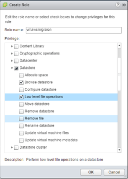

3.	将此 vCenter 角色分配给连接器的服务账户，添加针对要迁移的 VM 的数据中心的传播权限。

##### 第二步：配置连接器

1.	在控制台中打开 AWS Server Migration，选择 Connectors -> SMS Connector setup guide。
    
    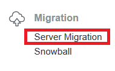
    
2.	在 AWS Server Migration Connector setup 页面上，选择 Download OVA 下载连接器。 
3.	在 vSphere 客户端点击 File -> Deploy OVF Template，将下载的连接器 OVA 部署到 VMware 环境中。
4.	打开连接器的虚拟机控制台并使用密码 ec2pass 以 ec2-user 身份进行登录。在系统提示时提供新密码。 
5.	获取连接器的 IP 地址，如下所示：

    ```sh
    Current network configuration: DHCP
    IP: 192.0.2.100
    Netmask: 255.255.254.0
    Gateway: 192.0.2.1
    DNS server 1: 192.0.2.200
    DNS server 2: 192.0.2.201
    DNS suffix search list: subdomain.example.com
    Web proxy: not configured
    Reconfigure your network:
      1. Renew or acquire a DHCP lease
      2. Set up a static IP
      3. Set up a web proxy for AWS communication
      4. Set up a DNS suffix search list
      5. Exit
    Please enter your option [1-5]:
    ```

6.	在连接器的网络配置菜单中，配置 DNS 后缀搜索列表中的域后缀值。
7.	在 Web 浏览器中，通过 IP 地址 (https://ip-address-of-connector/) 访问连接器 VM，在页面选择 Get started now。

    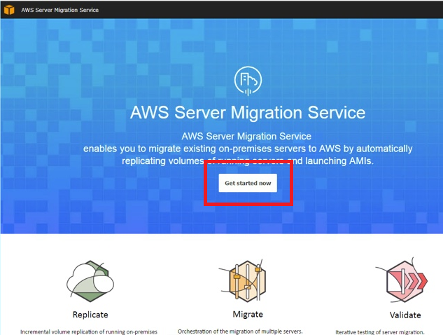
    
8.	阅读许可协议，选中复选框，然后选择 Next。 
9.	为连接器创建密码。
    
    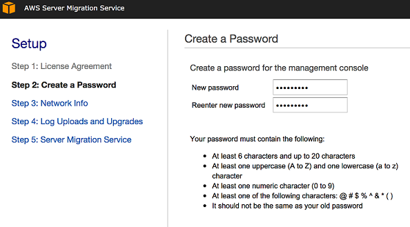
    
10.	选择 Upload logs automatically 和 服务器迁移连接器 auto-upgrade。 

    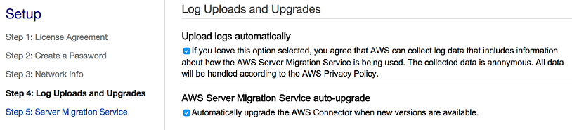

11.	对于 AWS Region，从列表中选择您所处区域。对于 AWS Credentials，输入您的 AWS 账户权限中创建的 IAM Credentials。选择 Next。 
12.	对于 vCenter Service Account，输入步骤 3 中的 vCenter 主机名、用户名和密码。选择 Next。 
13.	接受 vCenter 证书后，完成注册，然后查看连接器配置控制面板。

    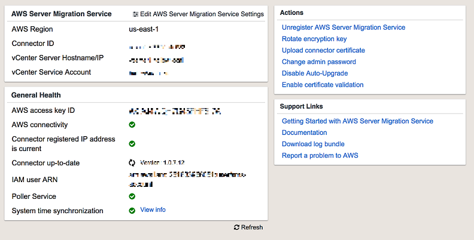

14.	验证 Connectors 页面中是否显示您已注册的连接器。 


##### 第三步：使用 AWS SMS 控制台复制 VM

1. 如尚未导入目录，请选择 Servers -> Import server catalog。如需添加的新服务器，请选择 Re-import server catalog。
2. 选择要复制的服务器，然后选择 Create replication job。

    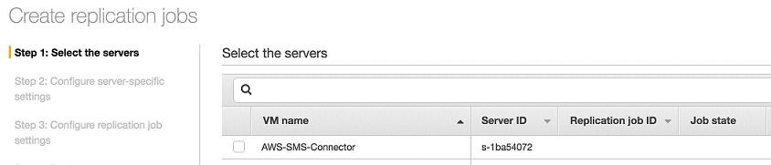
    
3. 在 Configure server -> specific settings 页面上的 License type 列中，选择要从复制作业创建的 AMI 的许可类型。选择 Auto 时 AWS SMS 会自行选择适当的许可。注意，Linux 服务器只能使用自带许可 (BYOL)，Windows 服务器可以使用 AWS 提供的许可或 BYOL。 点击 Next。
4. 在 Configure replication job settings 页面上，有以下设置可用：

    -	 Replication job type - replicate server every interval 选项按您从菜单提供的间隔创建新的 AMI，创建一个重复的复制过程。 One-time migration 选项会触发服务器单个复制。
    -	Start replication run - 可配置复制行为为立即开始或在未来 30 天内的某一日期和时间开始。日期和时间设置会参考浏览器的本地时间。
    -	IAM service role - 提供您之前创建的 IAM 服务角色。
    -	Description - 提供复制运行的描述。(可选) 
    -	Enable automatic AMI deletion - 当复制 AMI 数量超出数字时删除较早的复制 AMI。
    -	启用通知 -  Amazon Simple Notification Service (Amazon SNS) 会在复制作业完成、失败或被删除时通知列表中的收件人。

5. 选择 Next。
6. 在“Review”页面上，检查您的设置。如果所有设置均正确，请选择 Create。要更改设置，请选择 Previous。

##### 第四步： 监控和修改服务器复制作业

 - 在 AWS SMS 控制台中，点击 Replication jobs 可查看所有复制作业。
   选择其中一个复制作业，在下方的窗格中查看详细信息。Job details 选项卡显示当前复制运行的信息。Run history 选项卡显示有关选定复制作业的所有复制运行的详细信息。

 - 如更改作业参数，请在 Replication jobs 页面上选择一个作业，点击 Actions -> Edit replication job。在 Edit configuration job 表单中输入新信息后，选择 Save 以提交您的更改。
   
##### 第五步： 关闭复制

 - 如需在复制完服务器后删除复制作业创建的其他服务。请在 Replication jobs 中选择对应作业，点击 Actions -> Delete replication jobs。在确认窗口中，选择 Delete。该操作不会删除创建的AMI。
 - 如需清除服务器目录，请选择 Servers -> Clear server catalog。
 - 如需取消连接器关联，请点击 Connectors，选择要取消关联的连接器。在其信息部分的右上角点击 Disassociate，在确认窗口中选择 Disassociate。

## Part 2: 使用vm-import导入您的VM

本指导将逐步描述如何从 VM 中导出虚拟系统，使用 AWS Command Line Interface(AWS CLI) 或 API 工具将其导入 Amazon EC2。在开始操作前，请确保您的电脑中已经安装有 AWS CLI （请参考[AWS CML用户指南](https://docs.aws.amazon.com/zh_cn/cli/latest/userguide/installing.html)）。

### 步骤一  配置AWS CLI

安装客户端后，请在 AWS 控制台中选择 IAM User，创建安全证书并下载访问安全密钥，根据 AWS Access Key 和 AWS Secret Access Key 配置帐户。

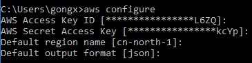

### 步骤二 配置并导出VM

在导出前，需确保 VM 具有以下几种配置：

Windows系统：

  - 启用 Remote Desktop (RDP) 以进行远程访问。
  - 请确保该主机防火墙 (Windows 防火墙或类似防火墙) 允许访问 RDP。
  - 确保管理员账户和所有其他用户账户均有密码，否则导入可能失败。
  - 在 VM 上安装适当的 .NET Framework 版本。请注意，如果需要，系统会自动在您的 VM 上安装 .NET Framework 4.5 或更高版本。
  - 在您的 Windows VM 上禁用 Autologon。
  - 设置 RealTimeIsUniversal 注册表项。有关更多信息，请参阅 Amazon EC2 用户指南（适用于 Windows 实例） 中的设置时间。

Linux系统：

  - 在VM中启用SSH远程访问，并保证VM防火墙允许外部访问VM。虽然允许基于密码的SSH，但为安全起见，建议使用公共密钥登录。
  - 在VM中配置一个非root用户。（可选）
  - 确保 Linux VM 将 GRUB（传统 GRUB）或 GRUB 2 作为其启动加载程序。
  - 确保 Linux VM 使用下列根文件系统之一：EXT2、EXT3、EXT4、Btrfs、JFS 或 XFS。
  - 关闭所有反病毒软件，从 VMware 虚拟机上卸载 VMware 工具。
  - 保持网络设置为 DHCP 而不是静态 IP 地址。
  - 导入的 Linux VM使用 64 位映像

完成导入准备工作后可以从虚拟环境中将 VM 导出。

AWS支持四种格式的磁盘：开放虚拟化存档 (OVA)、虚拟机磁盘 (VMDK)、虚拟硬盘 (VHD/VHDX) 和原始格式。您也可以选择将开放虚拟化格式 (OVF)作为导出格式，OVF通常包含一个或多个 VMDK、VHD 或 VHDX 文件。

有关更多信息，请参阅您的虚拟化环境的文档。例如：
  - VMware - VMware 网站上的[导出 OVF 模板](http://pubs.vmware.com/vsphere-4-esx-vcenter/topic/com.vmware.vsphere.vmadmin.doc_41/vc_client_help/importing_and_exporting_virtual_appliances/t_export_a_virtual_machine.html)
  - Citrix - Citrix 网站上的[将 VM 导出为 OVF/OVA](http://docs.citrix.com/en-us/xencenter/6-2/xs-xc-vms-exportimport/xs-xc-vms-export-ovf.html)
  - Microsoft Hyper-V - Microsoft 网站上的[导出和导入虚拟机概览](https://technet.microsoft.com/en-us/library/hh831535.aspx)

本示例中我们使用VirualBox，该应用软件是一款小巧精悍、功能齐全的免费应用软件，且支持导出OVF/OVA格式的VM。

导出VM时，在VirualBox主界面打开File->Export Appliance，选择需要导出的虚拟机，点击Next。
选择导出配置，这里可以选择OVF/OVA两种格式，并选择保存地址。

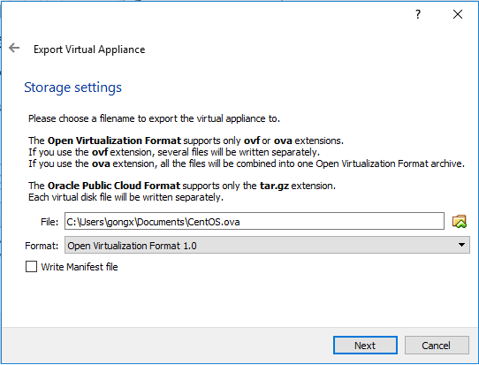

接下来对导出的VM添加说明信息后，就可以导出了，这里大约需要等待3分钟。

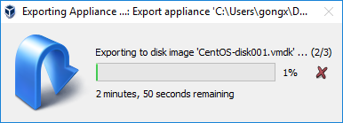

### 步骤三 将VM作为映像导入

您可以使用 VM Import/Export 将虚拟机 (VM) 映像作为 Amazon 系统映像 (AMI) 从虚拟化环境导入到 Amazon EC2 中，并用于启动实例。随后也可以将 VM 映像从实例导回到虚拟化环境中。

##### 1.	创建VM import服务角色

VM Import 需要一个角色在您的账户中执行特定的操作，例如：从 Amazon S3 存储桶下载磁盘映像

###### 上传 ova 镜像至S3存储桶

请参考[如何向 S3 存储桶添加对象](http://docs.amazonaws.cn/AmazonS3/latest/gsg/PuttingAnObjectInABucket.html)

###### 创建服务角色

 - 利用以下策略创建名为 trust-policy.json 的文件。

    ```sh
    {
        "Version": "2012-10-17",
        "Statement": [{
            "Effect": "Allow",
            "Principal": { "Service": "vmie.amazonaws.com" },
            "Action": "sts:AssumeRole",
            "Condition": {
                "StringEquals":{
                    "sts:ExternalId": "vmimport"
                }
            }
        }]
    }
    ```
    
 - 使用 create-role 命令创建名为 vmimport 的角色，并向 VM Import/Export 提供对该角色的访问权。请确保指定 trust-policy.json 文件的完整路径，并且为路径**添加 file:// 前缀**。

    ```sh
    aws iam create-role --role-name vmimport --assume-role-policy-document  file://trust-policy.json
    ```

 - 创建名为 role-policy.json 的文件并添加下面的策略，其中，**请将\<disk-image-file-bucket> 替换为存储ova映像的S3存储桶**，这里需注意，**如果您在中国区，请将 Resource 中 arn:aws:s3 更改为 arn:aws-cn:s3**。

    ```sh
    {
        "Version":"2012-10-17",
        "Statement":[{
            "Effect":"Allow",
            "Action":[
                "s3:GetBucketLocation",
                "s3:GetObject",
                "s3:ListBucket" 
            ],
            "Resource":[
                "arn:aws:s3:::<disk-image-file-bucket>",
                "arn:aws:s3:::<disk-image-file-bucket>/*"
            ]
        },
        {
            "Effect":"Allow",
            "Action":[
                "ec2:ModifySnapshotAttribute",
                "ec2:CopySnapshot",
                "ec2:RegisterImage",
                "ec2:Describe*"
            ],
            "Resource":"*"
        }]
    }
    ```
    
 - 使用下面的 put-role-policy 命令将策略挂载到之前创建的角色。    

    ```sh
    aws iam put-role-policy --role-name vmimport --policy-name vmimport             --policy-document file://role-policy.json
    ```
    
##### 2.	导入映像任务

- 创建名为containers.json的文件。其中，**\<my-import-bucket>**为您上传 ova 镜像的 S3 桶的名称，**\<vms/my-windows-2008-vm.ova>** 为您上传的 ova 镜像**在 S3 桶中的地址**。

    ```sh
    [{
        "Description": "Windows 2008 OVA",
        "Format": "ova",
        "UserBucket": {
            "S3Bucket": "<my-import-bucket>",
            "S3Key": "<vms/my-windows-2008-vm.ova>"
        }
    }]
    ```

 - 导入OVA。

    ```sh
    aws ec2 import-image --description " Centos 7.0 " --disk-containers file://containers.json
    ```

- 记录下输出信息中的 **ImportTaskId**

  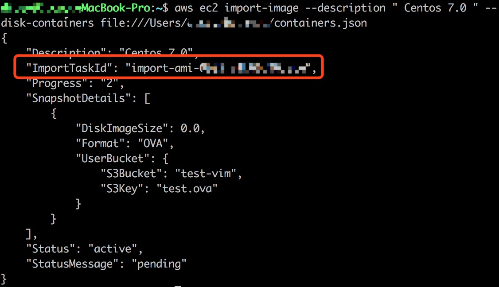

##### 3.	检查您的导入映像任务的状态

请根据上一步保留的 ImportTaskId 值自行替换该值，即可查询该任务的情况。

    aws ec2 describe-import-image-tasks --cli-input-json "{ \"ImportTaskIds\":         [\"import-ami-fggrs8es\"], \"NextToken\": \"abc\", \"MaxResults\": 10 } "

上述命令会根据 AWS 的处理进度，返回查询任务响应中的Status，依次为“Pending”、“Converting”、“Updating”、“Updated”、“Preparing AMI”等。整个的处理过程持续10+分钟，请耐心等待。

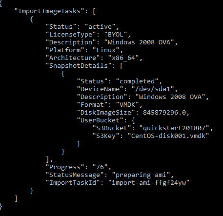
