# 将域名从GoDaddy迁移至Route 53

该指南将逐步介绍如何将 GoDaddy 的域名转移到 Amazon Route 53 服务，在开始前请确认以下几点：

 - 您在该站点的域名已经注册60天以上。
 - 请确认您的域名后缀（.com, .cn, .uk等）在亚马逊业务支持范围内查看[可向 Amazon Route 53 注册的域](https://docs.aws.amazon.com/zh_cn/Route53/latest/DeveloperGuide/registrar-tld-list.html)。
 - 部分顶级域名需更改参数，例如所有者名称。
 - 请确保您注册该域名的网站具有转移域名的服务。

注：本实例中使用 GoDaddy 中注册的域名作为案例。

## 迁移DNS服务

若您的域的DNS服务处于正在使用中，希望在流量不受影响下迁移域，请参考本节步骤，在迁移域名前将您的 DNS 服务迁移到 Route 53 中，如您的域的 DNS 服务处于空闲状态，或您的运营商迁移域名后也继续支持 DNS 服务，可跳过本部分，从**步骤一**开始。

### 1. 从当前DNS服务提供商获取当前DNS配置文件（可选）

在 GoDaddy 登录后，点击需要迁移的域名右侧的 DNS 按钮，在弹出网页下方的 Advanced Features 下选择对应操作。您可使用该配置文件在 Route 53 中重新配置 DNS 服务。

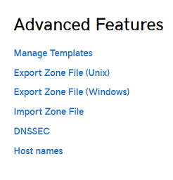

### 2. 创建托管区域

在Route 53中创建一个与您的域同名的托管区域，在该区中创建记录。Route 53 会自动为该域创建名称服务器（NS）和授权起始点（SOA）记录。步骤如下：

#### 创建托管区域

首先打开[Route 53 服务](https://console.aws.amazon.com/route53/)控制台。
 
 - 若您是首次使用Route 53, 请在 DNS Managment 下点击 Get Started Now。
 
   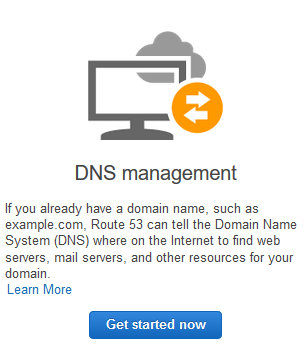
   
 - 在 Hosted Zones 中点击 Created Hosted Zone。
 - 在该窗口中，输入您的域名，填写注释（可选）。
 - Type 选项保留默认值 Public Hosted Zone。
 - 选择 Create。
   
   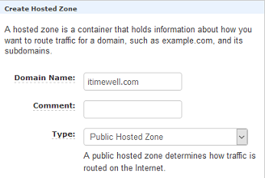

#### 创建记录

   在您创建的托管区域中创建记录，定义您的域和子域的流量的路由规则。有以下三种方式供您选择：

 - 1.导入区域文件
	
   导入 DNS 区域文件自动创建标准 DNS 记录。 请参阅[通过导入区域记录创建记录](https://docs.aws.amazon.com/zh_cn/Route53/latest/DeveloperGuide/resource-record-sets-creating-import.html)

 - 2.在控制台单独创建记录
	
   在控制台中创建记录。Route 53 支持同时创建别名记录和非别名记录。
	
 - [选择路由策越](https://docs.aws.amazon.com/zh_cn/Route53/latest/DeveloperGuide/routing-policy.html)
 - [在别名和非别名记录之间做出选择](https://docs.aws.amazon.com/zh_cn/Route53/latest/DeveloperGuide/resource-record-sets-choosing-alias-non-alias.html)
 - [使用Amazon Route 53控制台创建记录](https://docs.aws.amazon.com/zh_cn/Route53/latest/DeveloperGuide/resource-record-sets-creating.html)

 - 3.以编程方式创建记录
	
   您可以使用某个 AWS 开发工具包、AWS CLI、适用于 Windows PowerShell 的 AWS 工具或 Route 53 API。

#### 减小TTL设置

   TTL（生存时间）为 DNS 解析程序的缓存记录及使用缓存信息的时间。当 TTL信息过期时，解析程序会向域的 DNS 服务提供商查询最新消息，缩短 TTL 时间可以减小您在发现问题后的恢复时间。

   Route 53 NS 的标准 TTL 默认设置为172800秒或2天，您可将其减小到15分钟左右。

 - 登录 AWS 管理控制台并通过以下网址打开 Route 53 控制台：https://console.aws.amazon.com/route53/。

 - 在导航窗格中选择 Hosted Zones。

 - 选择托管区域的名称。

 - 点击对应 NS 记录。

 - 更改 TTL (Seconds) 的值。我们建议您指定一个介于 60 秒和 900 秒 (15 分钟) 之间的值。

 - 选择 Save Record Set。

   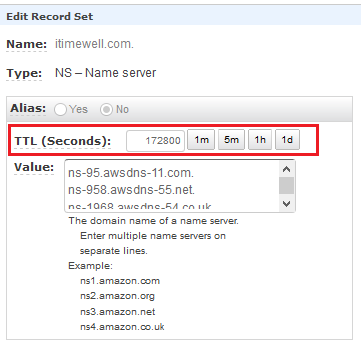

#### 等待原TTL过期

   若您的域正在使用中，则 DNS 解析程序将会缓存当前 DNS 服务提供商提供的名称服务器的名称。最长会保存近两天。为确保一次性完成 DNS 服务迁移，请在减小 TTL 后等待**两天**。两天后解析程序将获取当前名称服务器，并且获取您在指定的新 TTL 数值。

#### 更新当前DNS服务提供商NS记录

   该步骤将配置 Amazon Route 53 作为域的 DNS 服务，更新当前 DNS 服务提供商的 NS 记录，请参考以下步骤：

 1. 在 Route 53 控制台中，获取您的托管区域的名称服务器：

    - 登录 AWS 管理控制台并通过以下网址打开 Route 53 控制台：https://console.aws.amazon.com/route53/。

    - 在导航窗格中，选择 Hosted zones。

    - 在 Hosted zones 页面上，选择适用的托管区域的单选按钮 (而不是名称)。

    - 记下列出的针对 Name Servers 的四个名称。
    
   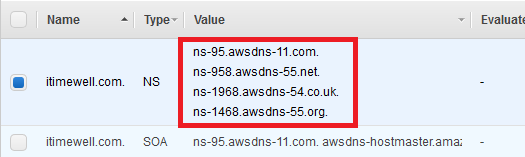

 2. 在 GoDaddy 更新托管区域的 NS 记录。进入 DNS Management 页面,更改 NameServer 部分。

    - 记录当前托管区域的 NS 记录中的 NS 名称，用于保存记录。
    - 添加您在上步中获取的四个 Route 53 NameServer 的名称。
    - 点击 Save。
   
   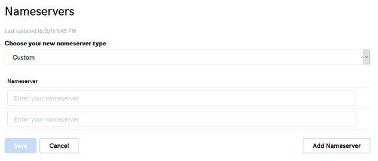

#### 监控域的流量(可选)

更改后，您可以监控域的流量，确定未受影响后，继续下一个步骤。

#### 更改TTL时间

在 Hosted Zones 中选择托管区域的名称，点击 NS 记录，将 TTL 时间改为最大，我们建议更改为172800秒，点击 Save Record Set。
	
#### 将域注册转移到Amazon Route 53

现在您已将域的 DNS 服务转移到 Amazon Route 53，您可以继续将域注册商转为 Route 53。

## 步骤一 在GoDaddy账户中解锁域名转换权限

登录 GoDaddy 网站，点击 My Products，选择对应域名下方的 Manage 进入 Domain Settings 界面。

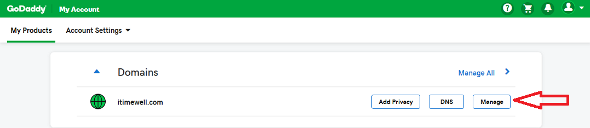

在该页面中找到 Additional Setting，点击 Domain lock 旁的 Edit。

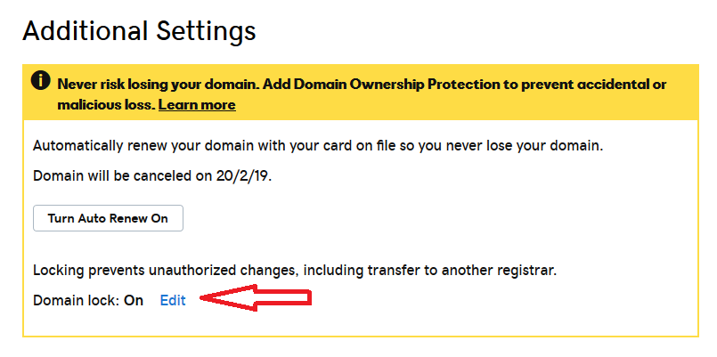
 
关闭 Domain lock，等待 GoDaddy 执行您的更改。完成后，您将收到一封来自 GoDaddy 的邮件，标题为 Domain Status Notification, 提示您修改完毕。

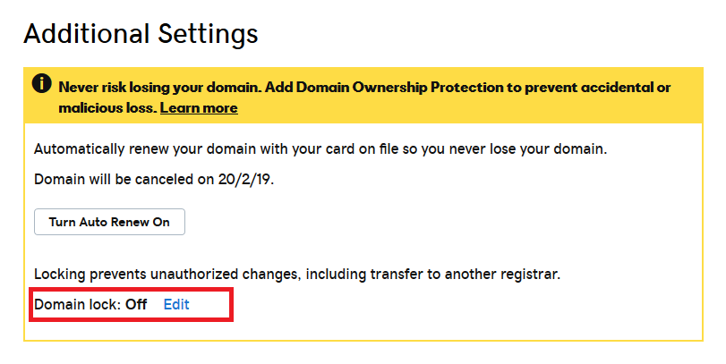

## 步骤二 从 GoDaddy 或许授权码到 AWS

我们需要从 GoDaddy 获取授权码，授权 Route 53 获取该域名。该步骤需要在 AWS 控制台使用授权码提交域名迁移请求。

同样在 Domain Setting 页面，在 Additional Settings 下面，点击 Get authorization code。

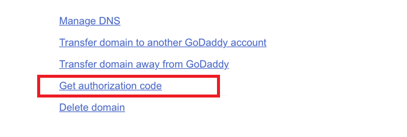

您将收到一封邮件提示您获取授权码。

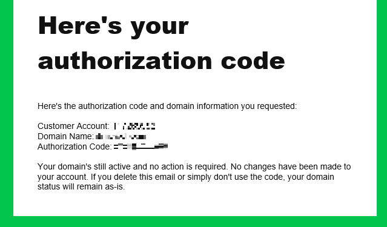

## 步骤三 在Amazon Route 53 控制台提交迁移请求

进入 AWS 控制台，点击 Amazon Route 53。在 Domain 下方，点击 Registered Domains -> Transfer Domain。 输入域名并选择您域名的后缀。点击 Check。

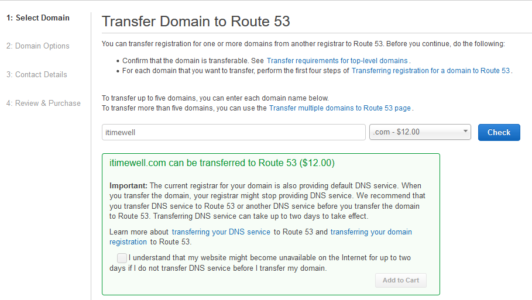

在弹出确认框勾选可选框。通常您需要将 DNS 解析服务迁移到 Route 53来保证服务正常运行。 

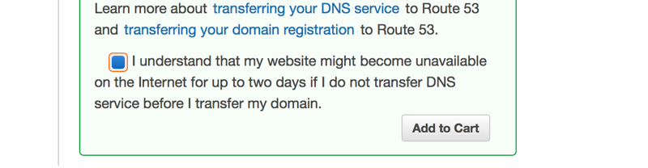

点击 Add to cart。

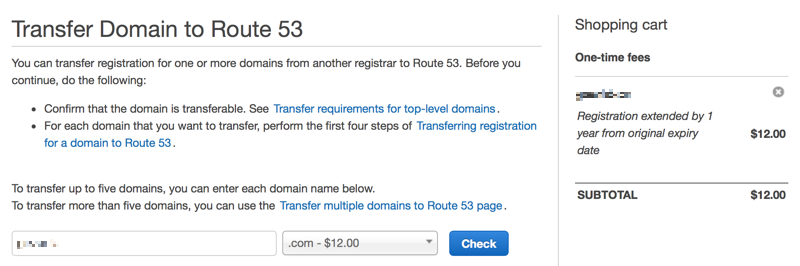

可在该页面继续添加其他您希望迁移的域名。点击位于页面底部 Continue 提交。

下一个页面中输入您 GoDaddy 账户的 Authorization code。 AWS 会询问如何管理您的 NS 服务。如果您已将 DNS 服务迁移到 Amazon Route 53，可选择第二个选项。

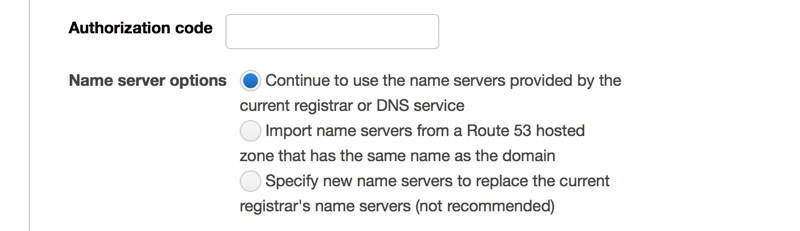

点击 Continue 并填写注册信息表。您可以选择是否隐藏信息，如选择是，您的个人信息将仅被提供给 ICANN 用于注册。 

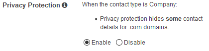

点击 Continue，并确认您填写的信息是否正确。如是，勾选下图中的选择框，并点击 Complete Purchase。

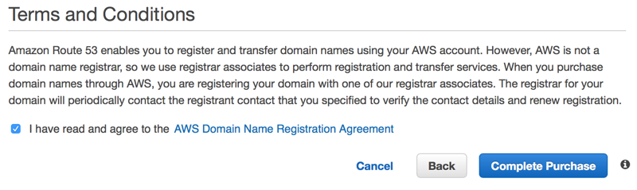

## 步骤四 授权 Amazon Route 53 迁移域

完成上述操作后，您将看到您的域名处于 Pending Transfer 的状态。 AWS 将会给域的所有者发送一封邮件。点击该邮件中的链接，在弹出页面中选择 Yes，并点击 Submit。

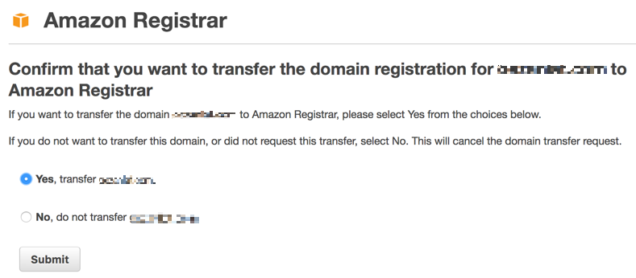

## 步骤五 在 GoDaddy 上通过迁移请求

当您完成步骤四后，GoDaddy 将会给您发送一封请求通过迁移的邮件。 

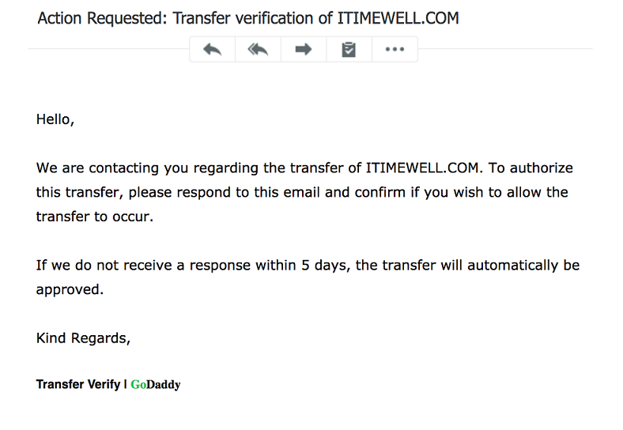

进入您的 GoDaddy 账户，依次选择 My Domains -> Pending transfer out 下面的 view details。

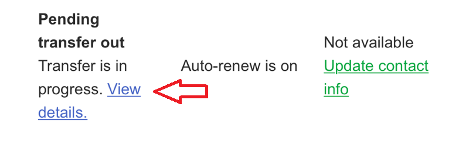

选择您需要转移的域名，点击 Accept or Decline。

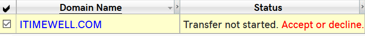

在弹出页面选择 Accept，点击 OK。

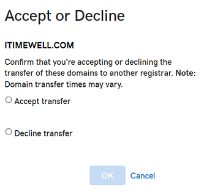

## 步骤六 完成迁移

在迁移结束后，您将收到 AWS 的邮件通知域名迁移成功。 Route 53 的  Registered domains 将会显示您已迁移的域名。

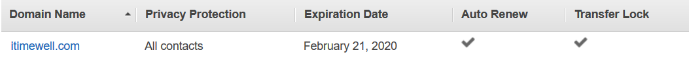

## 备注

如您未提前迁移 DNS 服务，需等待48个小时。迁移您的域名注册商不会产生额外的时间开销。

