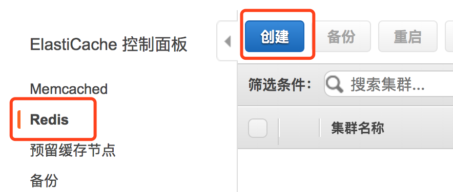
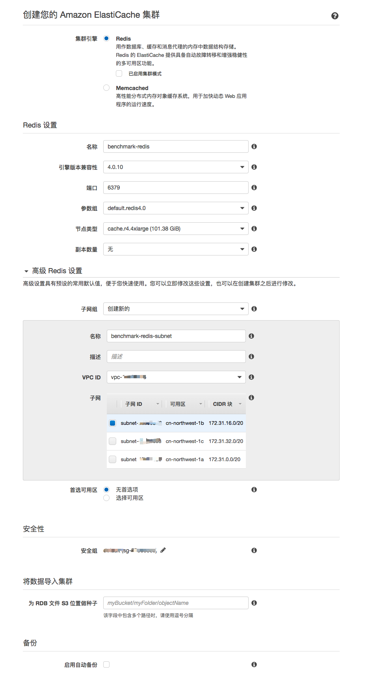
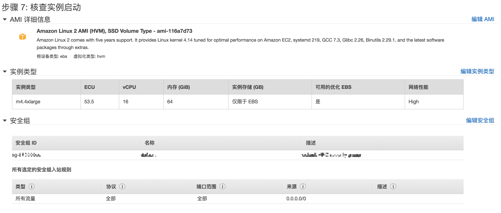
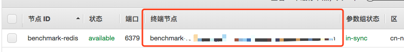
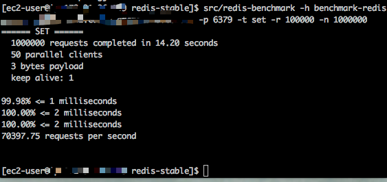

# Amazon ElastiCache for Redis 基准测试

本文主要目的是为 ElasticCache 下的 Redis 提供测试指南. 

完成测试的时间大约为10**分钟**

> **重要**
>
> 本测试默认您已经拥有了 AWS 账户并创建了 IAM 用户
>
> 若未执行以上设置，可参考[这里](https://docs.aws.amazon.com/zh_cn/AWSEC2/latest/UserGuide/get-set-up-for-amazon-ec2.html#sign-up-for-aws)

## 配置安全组

新建 VPC 安全组，具体步骤参考[适用于 Amazon VPC 的 IPv4 入门](https://docs.aws.amazon.com/zh_cn/AmazonVPC/latest/UserGuide/getting-started-ipv4.html#getting-started-create-security-group)

将安全组的**入站规则**设置为

- **Type**: ALL Traffice
- **Protocol**: ALL
- **Port Range**: ALL
- **Source**: 选择 **Custom IP**，然后键入 `0.0.0.0/0`。

> **重要**
>
> 除演示之外，建议不要使用 0.0.0.0/0，因为它允许从 Internet 上的任何计算机进行访问。在实际环境中，您需要根据自己的网络设置创建入站规则。

## 准备 Redis

1. 登录 AWS 管理控制台并通过以下网址打开 Amazon ElastiCache 控制台：<https://console.amazonaws.cn/elasticache/>。

2. 选择控制面板中的 **Redis**, 在点击**创建**。

   

3. 在**创建您的 Amazon ElasticCache 集群**界面, 按照以下内容填写:

   - **集群引擎**: **Redis**
   - **Redis 设置**
     - **名称**: `benchmark-redis`
     - **节点类型**: **cache.r4.4xlarge**
     - **副本数量**: **无**
   - **高级 Redis 设置**
     - **子网组**: **创建新的**
     - **名称**: **benchmark-redis-subent**
     - **VPC ID**: 选择一个具有**公有子网**的VPC(建议使用**默认 VPC**), 点击[这里](vpc_guide.md)查看关于 VPC 的设置指南
     - **子网**: 选择一个**公有子网**
     - **首选可用区**: **无首选项**
   - **安全性**
     - **安全组**: 选择您在**配置安全组**这一步骤中新建的安全组
   - **备份**
     - **启动自动备份**: **不勾选**
   - **其他**: **全部保持默认**

   

4. 选择 **创建** 以启动集群。

## 准备 EC2

1. 启动实例

   - 打开 Amazon EC2 控制台 <https://console.aws.amazon.com/ec2/>。
   - 从控制台控制面板中，选择 **启动实例**。
   - **Choose an Amazon Machine Image (AMI)** 页面显示一组称为 *Amazon 系统映像 (AMI)* 的基本配置，作为您的实例的模板。选择 Amazon Linux AMI 2 的 HVM 版本 AMI。 
   - 在**选择实例类型** 页面上，您可以选择实例的硬件配置。选择 **m4.4xlarge** 类型 
   - 在**配置实例详细信息**页面上，自动分配公有 IP 选择**启用**，其他选择默认
   - 在**配置安全组**页面选择**选择一个现有的安全组**，并在表格中选择**配置 VPC**这一步骤中创建的安全组
   - 在**审核**页面选择**启动**

   

   - 当系统提示提供密钥时，选择 **选择现有的密钥对**，然后选择合适的密钥对。若没有创建密钥对，请参考[创建密钥对](https://docs.aws.amazon.com/zh_cn/AWSEC2/latest/UserGuide/get-set-up-for-amazon-ec2.html#create-a-key-pair)

     准备好后，选中确认复选框，然后选择 **启动实例**。  

2. 连接到 EC2

   请参考[使用 SSH 连接到 Linux 实例](https://docs.aws.amazon.com/zh_cn/AWSEC2/latest/UserGuide/AccessingInstancesLinux.html)

3. 下载和安装 GNU Compiler Collection (gcc)

   **在连接到 EC2 实例后**，在 EC2 实例的命令提示符中键入下面的命令，然后在确认提示符处键入 **y**

   ```shell
   sudo yum install gcc
   ```

4. 下载并编译 `redis-cli` 实用工具。此实用工具包含在 Redis 软件发布版中

   ```shell
   wget http://download.redis.io/redis-stable.tar.gz
   tar xvzf redis-stable.tar.gz
   cd redis-stable
   make
   ```

## 开始测试

在 **EC2 实例**的命令提示符处，键入以下命令，并使用您的集群的终端节点替换*<your-redis-endpoint>*中的内容



```shell
src/redis-benchmark -h <your-redis-endpoint> -p 6379 -t set -r 100000 -n 1000000
```

测试结果类似下图



若您需要其他情况下的性能测试, 可以参考 [Redis 中国站](http://www.redis.cn/topics/benchmarks.html)