# VPC 配置指南

本文主要包含以下内容

- public subnet  和 private subnet 的区别
- 如何新建 IGW, 如何更改路由表
- 如何创建 NAT 网关,如何更改路由表
- 合理的 web hosting 的网络拓扑
- VPC Wizard

## Public Subnet 与 Private Subnet

- **子网**: VPC 是跨**可用区**的. 在创建 VPC 后需要为**每个可用区**添加一个或多个子网. 子网**不可跨**可用区.
- **公有子网**( public subnet ): 子网的**关联路由表** **包含** 指向 **Internet 网关(Internet Gateways)**的路由的子网
- **私有子网**( private subnet): 子网的**关联路由表** **不包含** 指向 **Internet 网关(Internet Gateways)**的路由的子网
  - **仅限 VPN 的子网**: 特别的,一个子网没有通向 **Internet 网关(Internet Gateways)**的路由, 但**其流量会被路由到虚拟专用网关以进行 VPN 连接**, 则这个子网就是**仅限 VPN 的子网**

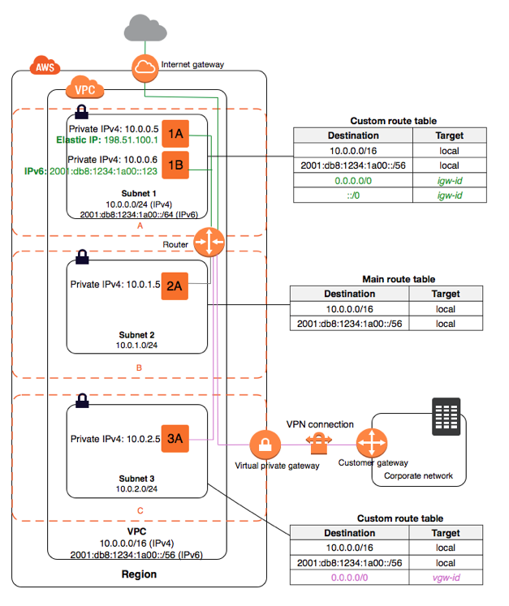

如上图, 

- **Subnet 1**: 有通向 Internet 网关的路由, 因此它是**公有子网**
- **Subnet 2**: 没有通向 Internet 网关的路由, 因此它是**私有子网**
- **Subnet 3**: 没有通向 Internet 网关的路由, 但流量可达 VPN , 因此它是**仅限 VPN 的子网**

## Internet Gateways

使用 **Internet 网关(Internet Gateways, igw)**, 可实现 VPC 中的实例与 Internet 之间的通信

Internet 网关有两个用途:

1. 在 VPC 路由表中为 Internet 可路由流量提供目标

2. 为已经分配了公有 IPv4 地址的实例执行网络地址转换 (NAT)

当生成AWS账户的时候，AWS系统会默认的在每一个区域内斗生成一个默认的VPC，并且这个默认的VPC已经绑定了一个Internet网关；一个Internet网关一次只能绑定一个VPC；当VPC中有EC2实例等AWS资源的时候，Internet网关是不能手动和相结合的VPC相分离的

> **路由表**
>
> 每个子网都会和路由表相结合使用，并且只能使用一个路由表；VPC中的子网是共有子网还是私有子网是**由该子网使用的路由表决定的**
>
> 如果该路由表中有Internet网关路由条目，那么该子网就是共有子网；
>
> 路由表由一系列的路由规则组成，决定了子网的访问权限；默认情况下，同一个VPC之间的子网之间是可以相互通信的；当路由表和子网已经结合的情况下，该路由表是不能被删除的。

#### 配置 Internet 网关

Internet 网关在配置时需要具有对应的**子网**, 在配置之前请确保您已经添加了所需的子网, 有关子网的更多信息, 请参阅[VPC 和子网](https://docs.aws.amazon.com/zh_cn/AmazonVPC/latest/UserGuide/VPC_Subnets.html)

- **创建 Internet 网关并将其附加到 VPC**

  - 打开 Amazon VPC 控制台 <https://console.aws.amazon.com/vpc/>。

  - 在导航窗格中，选择 **Internet Gateways (Internet 网关)**，然后选择 **Create internet gateway (创建 Internet 网关)**。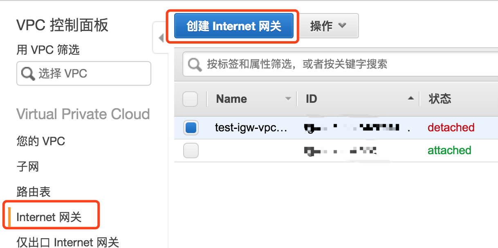

  - (可选) 为 Internet 网关命名，然后选择 **Create (创建)**

  - 选择刚刚创建的 Internet 网关，然后选择 **Actions, Attach to VPC (操作，附加到 VPC)**。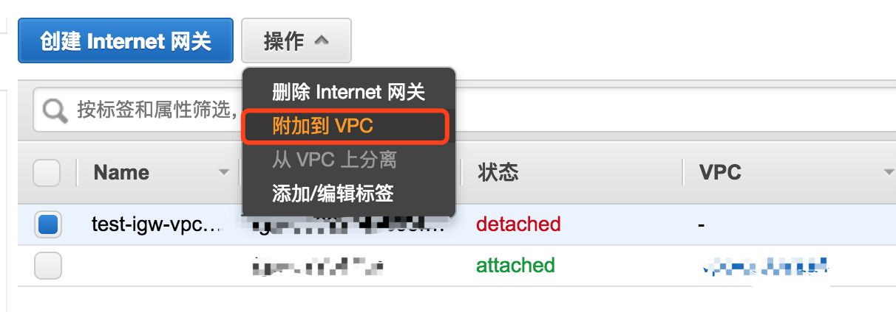

  - 从列表中选择 VPC，然后选择 **Attach (附加)**。

    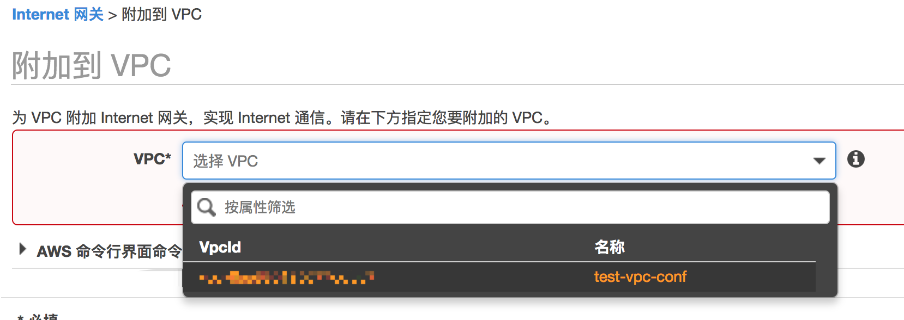

- **创建自定义路由表**

  - 打开 Amazon VPC 控制台 <https://console.aws.amazon.com/vpc/>。

  - 在导航窗格中，选择 **Route Tables**，然后选择 **Create Route Table**。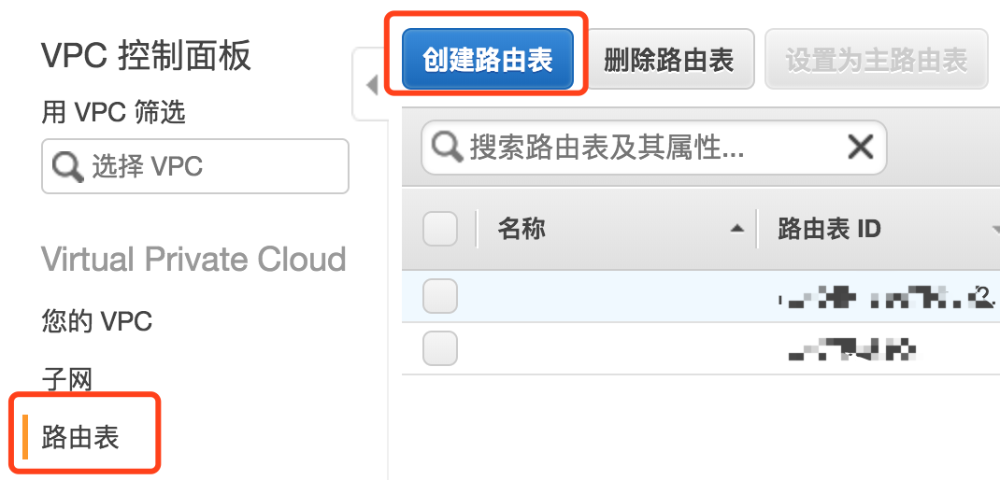

  - 在 **Create Route Table** 对话框中，可以选择命名您的路由表，选择您的 VPC，然后选择 **Yes, Create**。

    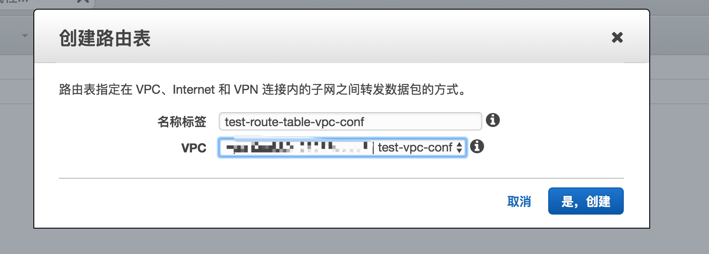

  - 选择您刚刚创建的自定义路由表。详细信息窗格中会显示选项卡，以供您使用其路径、关联和路线传播。

  - 在 **Routes** 选项卡中，依次选择 **Edit**、**Add another route**，然后根据需要添加以下路由。完成此操作后，选择 **Save**。

    - 对于 IPv4 流量，在 **Destination (目的地)** 框中指定 `0.0.0.0/0`，然后在 **Target (目标)** 列表中选择 Internet 网关 ID。
    - 对于 IPv6 流量，在 **Destination (目的地)** 框中指定 `::/0`，然后在 **Target (目标)** 列表中选择 Internet 网关 ID。

    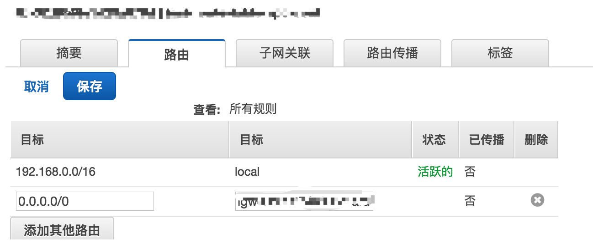

    > **关于这一步路由表配置的解释**
    >
    > 该路由表所属的**VPC** 的CIDR是`192.168.0.0/16`, 现该路由表有两个条目
    >
    > -  **local 网关路由条目**(第一行): 默认生成, 手动不能更改
    >
    >   **子网**可以通过 **local 网关路由条目**和**该 VPC (192.168.0.0./16)**中的**其他子网互相通信**
    >
    >   本条目是 VPC 间互相通信的保证, 无法修改
    >
    > - **Internet 网关路由条目**(第二行)
    >
    >   通过 **Internet 网关路由条目**, 子网可以通过其对应的**Internet 网关**和**外部网络(0.0.0.0/0)**通信
    >
    > 此时，这个子网由于有Internet网关路由条目就叫做**共有子网**, 如果这个子网的路由表中没有通过igw-xxxxxx这个Internet网关所对应的路由条目的话, 这个子网就不能访问外网,  就叫做私有子网

  - 在 **Subnet Associations** 选项卡上，选择 **Edit**，选中子网的 **Associate** 复选框，然后选择 **Save**。

    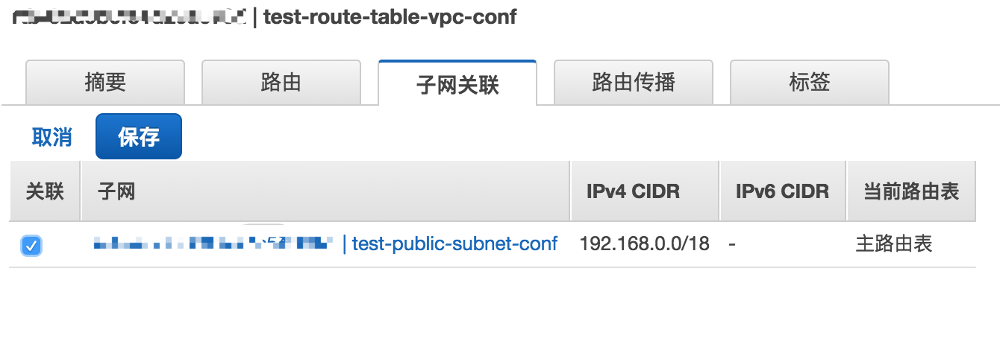

有关路由表的更多信息，请参见[路由表](https://docs.aws.amazon.com/zh_cn/AmazonVPC/latest/UserGuide/VPC_Route_Tables.html)。

## NAT 网关

使用**网络地址转换 (NAT) 网关**允许私有子网中的实例连接到 Internet 或其他 AWS 服务，但阻止 Internet 发起与这些实例的连接

要创建 NAT 网关，您必须指定 NAT 网关应处于哪个公有子网中。有关公有子网和私有子网的更多信息，请参阅[子网路由](https://docs.aws.amazon.com/zh_cn/AmazonVPC/latest/UserGuide/VPC_Subnets.html#SubnetRouting)。还必须在创建 NAT 网关时指定与该网关关联的[弹性 IP 地址](https://docs.aws.amazon.com/zh_cn/AmazonVPC/latest/UserGuide/vpc-eips.html)。创建 NAT 网关之后，必须更新与您的一个或多个私有子网关联的路由表，以将 Internet 绑定流量指向该 NAT 网关。这使您的私有子网中的实例可以与 Internet 通信。

#### 配置 NAT 网关

- **创建 NAT 网关**
  - 打开 Amazon VPC 控制台 <https://console.aws.amazon.com/vpc/>。

  - 在导航窗格中，依次选择 **NAT Gateways**、**Create NAT Gateway**。

    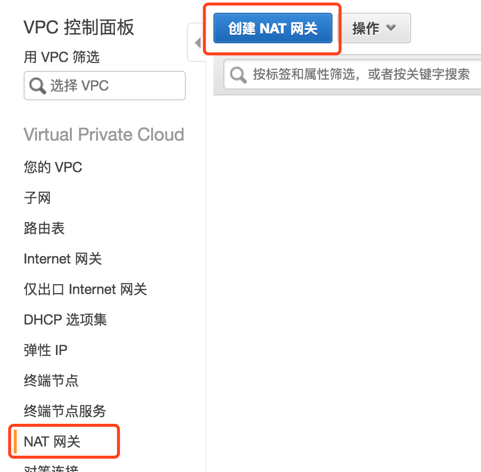

  - 指定要在其中创建 NAT 网关的子网，并选择要与该 NAT 网关关联的弹性 IP 地址的分配 ID。完成后，选择 **Create a NAT Gateway**。

    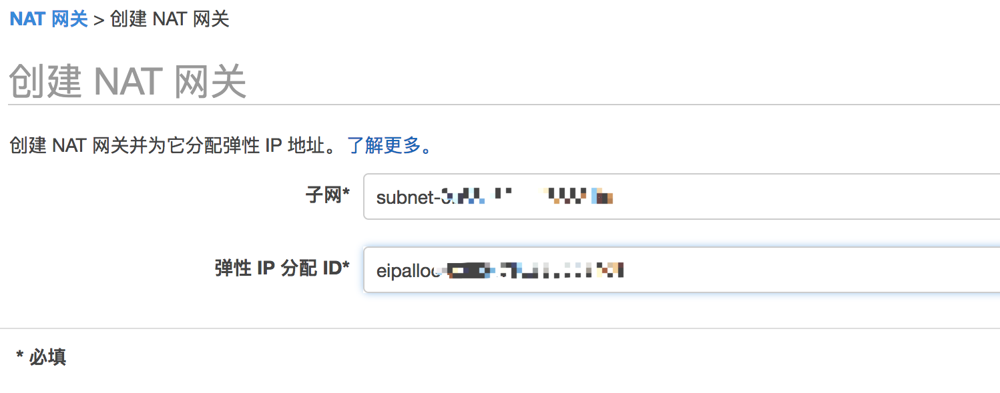

    > **注意**
    >
    > NAT 网关所处的子网必须为**公有子网**

  - NAT 网关会显示在控制台中。片刻之后，其状态会更改为 `Available`，此后它即准备好供您使用。

    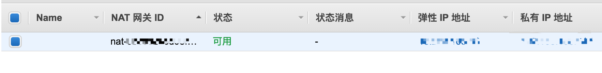

  如果 NAT 网关变为 `Failed` 状态，则表示在创建过程中发生了错误。有关更多信息，请参阅 [NAT 网关变为 Failed 状态](https://docs.aws.amazon.com/zh_cn/AmazonVPC/latest/UserGuide/vpc-nat-gateway.html#nat-gateway-troubleshooting-failed)。

- **为 NAT 网关创建路由**

  - 打开 Amazon VPC 控制台 <https://console.aws.amazon.com/vpc/>

  - 在导航窗格中，选择 **Route Tables**。

  - 选择与私有子网关联的路由表，然后依次选择 **Routes**、**Edit**。

  - 选择 **Add another route**。对于 **Destination**，键入 `0.0.0.0/0`。对于 **Target**，选择 NAT 网关的 ID。

    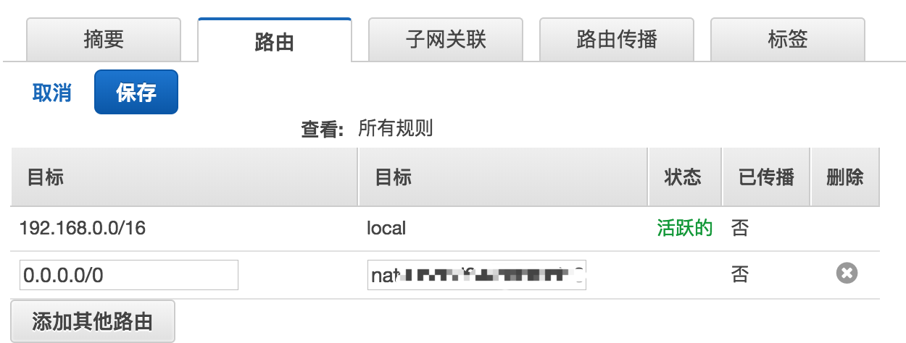

  - 在 **Subnet Associations** 选项卡上，选择 **Edit**，选中子网的 **Associate** 复选框，然后选择 **Save**

    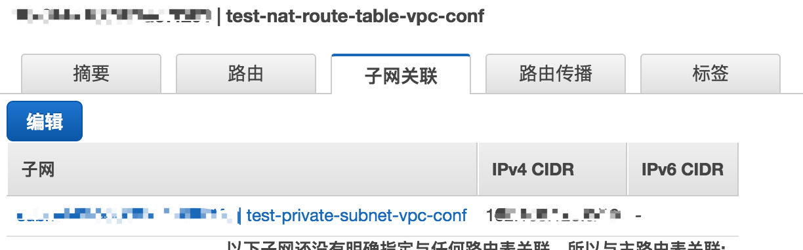

  - 选择 **Save**。

为确保 NAT 网关可以访问 Internet，与 NAT 网关所在子网关联的路由表必须包含使 Internet 流量指向 Internet 网关的路由。有关更多信息，请参阅 [创建自定义路由表](https://docs.aws.amazon.com/zh_cn/AmazonVPC/latest/UserGuide/VPC_Internet_Gateway.html#Add_IGW_Routing)。如果删除 NAT 网关，则 NAT 网关路由会保留为 `blackhole` 状态，直到您删除或更新这些路由。有关更多信息，请参阅 [在路由表中添加和删除路由](https://docs.aws.amazon.com/zh_cn/AmazonVPC/latest/UserGuide/VPC_Route_Tables.html#AddRemoveRoutes)。

## 合理的 web hosting 的网络拓扑

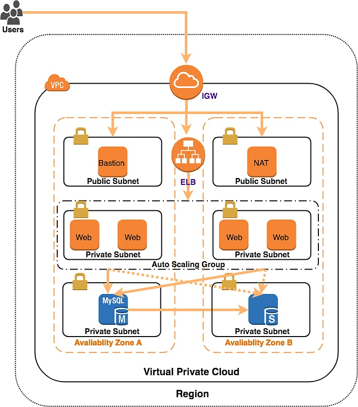

一个合理的 Web Hosting 应该包含有以下几部分:

- Internets Gateway
- ELB
  - 直接与 Internets Gateway 连接
  - 与 Auto Scaling 连接
  - 负责负载均衡
- 堡垒机(可用 NAT 实例代替)/ NAT 网关
  - 直接与 Internets Gateway 连接
  - 位与**公有子网**
  - 负责其他私有子网与 Internet 的通信
- 位与 Auto Scaling 中的实例
  - 实例应分别位与**多个可用区**的**私有子网**中
- 数据库实例
  - 位与**私有子网**中
  - 使用主从架构
  - **主**数据库与**从**数据库应位与**不同的可用区**中

## VPC Wizard

VPC 控制台中提供了四种 VPC 向导用于创建常用场景下的 VPC 的创建

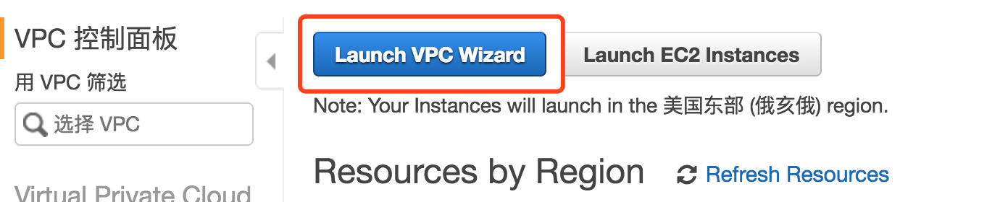

- [带单个公有子网的 VPC](https://docs.aws.amazon.com/zh_cn/AmazonVPC/latest/UserGuide/VPC_Scenario1.html#VPC_Scenario1_Implementation): 

  适用于运行单层、面向公众的 Web 应用程序 (如博客或简单网站) 的 VPC。

- [带有公有子网和私有子网( NAT)的 VPC](https://docs.aws.amazon.com/zh_cn/AmazonVPC/latest/UserGuide/VPC_Scenario2.html): 

  适用于运行面向公众的 Web 应用程序的 VPC，同时仍在第二个子网中保留非公开访问的后端服务器。

- [具有公有和私有子网以及 AWS 托管 VPN 访问的 VPC](https://docs.aws.amazon.com/zh_cn/AmazonVPC/latest/UserGuide/VPC_Scenario3.html): 

  适用于将数据中心扩展到云中的 VPC，并实现从 VPC 直接访问 Internet。

- [仅具有私有子网, 以及 AWS 托管 VPN 访问权限的 VPC](https://docs.aws.amazon.com/zh_cn/AmazonVPC/latest/UserGuide/VPC_Scenario4.html):

  适用于将数据中心扩展到云中的 VPC，无需将您的网络连接到 Internet 即可使用 Amazon 基础设备。

